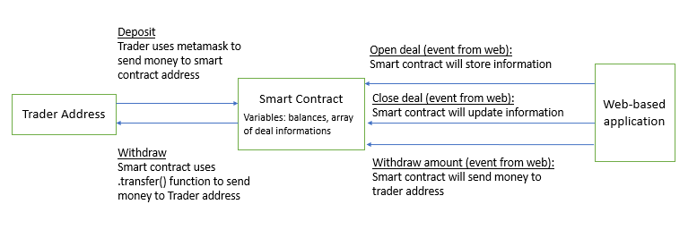

# NTUST_Big-data_Final-project: Application of smart contract on Forex trading

## Introduction

This is repository for the final project of Theory and Practice of Blockchain course. The description of project is here.

## Description
I. <strong>Idea:</strong>
  
  We aim to use the smart contract as a trading market which stores the information of deals, balances of the trader as well as other executive functions. The smart contract application is inspired by [Election smart contract from Dapp University](https://www.dappuniversity.com/articles/the-ultimate-ethereum-dapp-tutorial). 

  The picture below demonstrates the activities on this application. There are three objects and five activities here:
  
  
  
  * Web-based application which is the interface to customer is built by NodeJS
  * Trader address is the real trader account which deposit and withdraw from smart contract
  * Smart contract is the trading market which receives the deposit from trader and sends the money to trader when withdrawing. Besides, smart contract also stores the information of deals like a ledger of trading and updates the information everytime it receives offers from web-based application.
  
  Activities on application:
  
  * Trader at first should deposit an amount to smart contract address to have the balance for trading.
  * When trader opened a deal, the web-based application will call the open-deal function with parameters from smart contract. Then, smart contract will create new element in array of deals. 
  * When trader closed a deal, the web-based application will call the close-deal function with parameters from smart contract. Based on the index parameter from the offer, the smart contract will update the information in the corresponding element.
  * Trader can withdraw the money from the market by clicking on withdraw button. Then, the web-based application will call the sendMoney function from smart contract and smart contract will send money to asisgned address. 

II. <strong>How to run the application</strong>

  1. Firstly, we should install NodeJS to run an application wrote by [NodeJS](https://nodejs.org/en/).  
  2. Secondly, we clone the reposity from github. Then, we open cmd window in working project (which contained package.json) and type <ins>npm install</ins> to install node_modules mentioned in json file.
  3. Thirdly, installing truffle by typing: <ins>npm install -g truffle</ins>.  After finishing, we will have truffle files in C:\Users\lemin\AppData\Roaming\npm
  4. Next, we open Ganade before typing <ins>truffle test</ins>. After that, we type <ins>truffle migrate --reset</ins> to complete building the contract.  If it is successful, a json file will appear on folder /build/contracts/
  5. Finally, we type <ins>npm run dev</ins> to run the application with smart contract. Then, we log in the metamask and done.

  **<strong>Notes:</strong> 
  * Error about not finding address: Click on metamask settings -> connected sites. Then, we connect metamask to the web
  * Anytime we want to run the application or refresh the app it may be failed, we should build the contract and do it again from step 2 because the paramters stored in the contract conflicts to the parameters in website. The website has no database to store so parameters in website which is temporary will be refreshed everytime we refresh pages while the data in smart contract is stored in json file is no refreshed.  

## <strong>Weakness and Future work</strong> 

* In this project, there is an error that the money withdrawed should be not higher than the money that smart contract received when depositing. In the future, I hope and handle this problem by appling ERC20 to both receive and send money by smart contract itself.

